# Laporan Sementara Modul 1

## Nomor 1

---
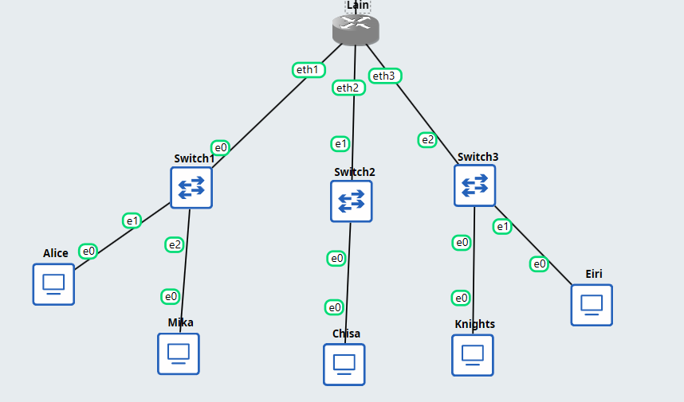

Router (lain) disini menggunakan debinet

config di router :
Konfigurasi IP tersebut dimasukkan pada *router* sebagai berikut (prefix kelompok adalah 10.82.x.x):

```bash
# Config eth1
auto eth1
iface eth1 inet static
    address 10.82.1.1
    netmask 255.255.255.0

# Config eth2
auto eth2
iface eth2 inet static
    address 10.82.2.1
    netmask 255.255.255.0

# Config eth3
auto eth3
iface eth3 inet static
    address 10.82.3.1
    netmask 255.255.255.0
```

Setiap *client* juga diatur IP statisnya melalui file `/etc/network/interfaces` di masing-masing *node*.
Bukti kalau router sudah berhasil meneruskan data antar switch (subnet). Di sini, *client* Alice melakukan ping ke IP *client* Chisa:


## Nomor 2

---


(NAT menggunakan eth0 di router sesuai instruksi pada soal)

Config di router untuk NAT:

```bash
# Config eth0 
auto eth0
iface eth0 inet dhcp
    up sysctl -w net.ipv4.ip_forward=1
    up iptables -t nat -A POSTROUTING -o eth0 -j MASQUERADE
```
Bukti berhasilnya terhubung:


## Nomor 3

Diminta untuk memastikan seluruh *client* yang berada di bawah Switch 1, Switch 2, dan Switch 3 dapat saling terhubung dan berkomunikasi setelah router terhubung ke internet.

Dikarenakan di config router tadi sudah menambahkan:

```bash
up sysctl -w net.ipv4.ip_forward=1
```

Dimana perintah ini berguna untuk mem-forward routing dari satu *client* ke *client* lainnya.
Dan juga, di seluruh *client* sudah diatur IP statisnya beserta *gateway* yang mengarah ke router (10.82.x.1) melalui file konfigurasi `/etc/network/interfaces`.


Keterangan konfigurasi IP *Client*:
- 10.82.1.2 = Client pada Switch 1 (Mika)
- 10.82.2.2 = Client pada Switch 2 (Chisa)
- 10.82.3.2 = Client pada Switch 3 (Knights)

Mika kan berada di switch 1 jadi dilakukan ping untuk ip switch 2 dan 3, begitu juga yang lainnya, dilakukan ping untuk mengecek koneksi di switch yang lain


## Nomor 4

---

Untuk NAT Masquerade sudah di-setup sebelumnya di router:

```bash
up iptables -t nat -A POSTROUTING -o eth0 -j MASQUERADE
```

Tinggal bagian DNS Resolver:


Awalnya dicoba untuk ping google.com dan ternyata masih belum bisa. Lalu dilakukan pemasangan DNS resolver dengan memodifikasi file `/etc/resolv.conf` pada setiap *client* berbasis Linux (Alpine/Debian) menggunakan *command*:
```bash
echo "nameserver 8.8.8.8" > /etc/resolv.conf
```

Setelah itu coba ping google.com kembali dan sudah berhasil.

Bukti untuk client lainnya:


## Nomor 5

---

Diminta untuk mengantisipasi restart tiba-tiba pada node dengan memastikan konfigurasi jaringan (IP dan aturan NAT) bersifat persisten, serta membuat script pengecekan otomatis.

Karena konfig IP dan commmand menambahkan iptables (NAT) telah dimasukkan ke dalam file `/etc/network/interfaces` di router Lain (seperti yang ditunjukkan pada Nomor 1 dan 2), maka konfig tersebut dipastikan tidak akan hilang meskipun router di reboot.

Untuk cek status secara cepat, kami membuat script bash di `/root/cek_status.sh` pada router Lain. 

Isinya adalah:
```bash
echo '#!/bin/bash' > /root/cek_status.sh
echo 'ip -br a' >> /root/cek_status.sh
echo 'iptables -t nat -L -v -n' >> /root/cek_status.sh
chmod +x /root/cek_status.sh
```

Setelah router direstart, kami menjalankan script tersebut dengan mengeksekusi `/root/cek_status.sh`. Berikut adalah tangkapan layar bukti eksekusinya yang memperlihatkan daftar IP setiap interface (`ip -br a`) serta status tabel NAT yang memuat aturan MASQUERADE (`iptables -t nat -L -v -n`):

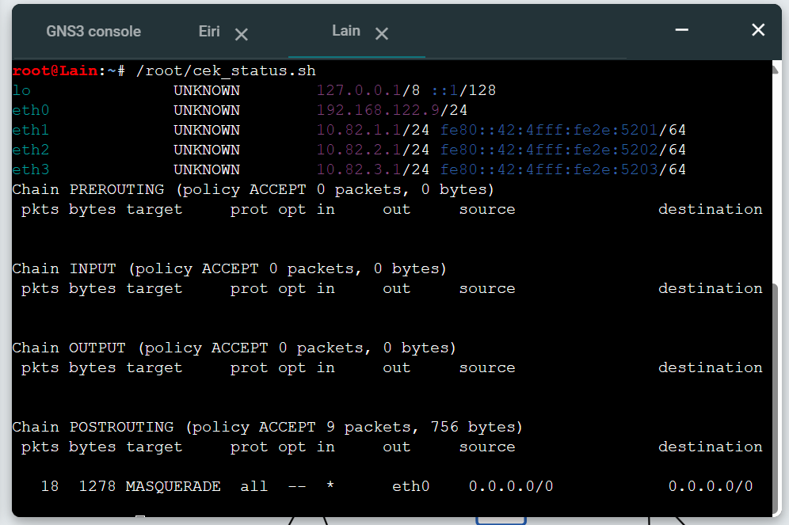

## Nomor 6

---

Filter yang digunakan adalah:
dns or icmp

Berikut adalah tangkapan layar dari hasil penyaringan Wireshark:

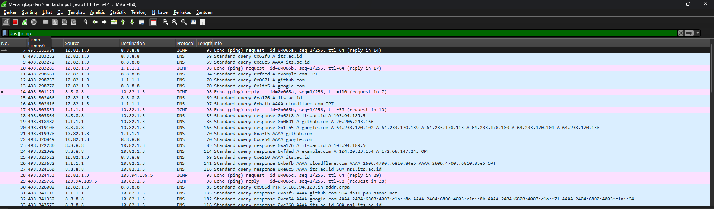

Terdapat beberapa paket yang muncul dari filter:
- Paket DNS: Terdapat aktivitas Standard query response untuk berbagai domain, seperti its.ac.id, github.com, cloudflare.com, dan google.com.
- Paket ICMP: Terdapat aktivitas pengiriman Echo (ping) request dan penerimaan Echo (ping) reply yang mengarah ke alamat IP publik seperti 8.8.8.8 dan 1.1.1.1.


## Nomor 7

---

Akses yang harus diterapkan adalah:
- alice memiliki hak akses read dan write.
- mika dibatasi hanya read-only.
- eiri dibatasi tanpa izin akses sama sekali (blacklist).

1. instal vsFTPd di chisa
2. bikin directory /var/wired/data
```bash
apt-get update
apt-get install vsftpd -y
mkdir -p /var/wired/data
```
3. bikin ketiga user tersebut 
```bash
useradd -d /var/wired/data -s /bin/bash alice
passwd alice

useradd -d /var/wired/data -s /bin/bash mika
passwd mika

useradd -d /var/wired/data -s /bin/bash eiri
passwd eiri
```


Untuk mengatur hak akses read dan write,
```bash
chown alice:alice /var/wired/data
```
 Sedangkan permission foldernya diatur menjadi 755 agar user lain hanya bisa read dan execute, tanpa write.

 ```bash
chmod 755 /var/wired/data
 ```

next, config vsftpd untuk mengizinkan akses write dan memblokir segala akses
```bash
cat << 'EOF' > /etc/vsftpd.conf
listen=YES
listen_ipv6=NO
anonymous_enable=NO
local_enable=YES
write_enable=YES
chroot_local_user=YES
allow_writeable_chroot=YES
userlist_enable=YES
userlist_file=/etc/vsftpd.userlist
userlist_deny=YES
EOF
```

Lalu add eiri ke blocklist

```bash
echo "eiri" > /etc/vsftpd.userlist
service vsftpd restart
```

Bukti eiri sudah ditolak: 
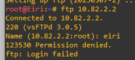

Bukti Alice punya akses write:

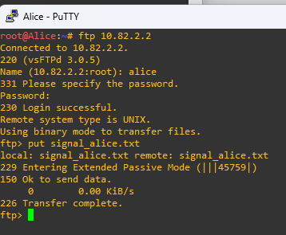

## Nomor 8

---

Jadi disini disuruh melakukan FTP client dari Knights ke FTP Server Chisa menggunakan akun alice.

digunakan dengan command
```bash
put knights_report.txt
```

Berikut screenshot wireshark setelah dilakukannya put:

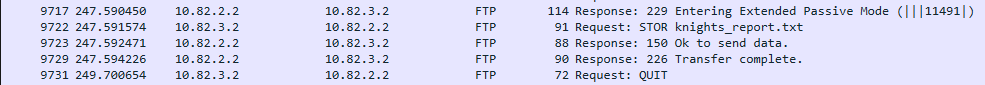

Dapat ditemukan:
- Ketika mengirimkan command put, Knights mengirimkan request STOR.
- Setelah transfer selesai, server merespons demgan kode 226.
- Setelah mengirimkan command put namun sebelum mengirimkan request STOR, server memasuki Extended Passive Mode (|||11491|) yang menunjukkan kalau port TCP yang digunakan adalah port 11491 untuk proses FTP ini

## Nomor 9

---

Untuk memvalidasi konfigurasi read-only pada user mika, dilakukan pengujian akses FTP dari node Mika ke server Chisa.

1. Dilakukan pengujian get, seharusnya bisa karena semuanya default punya akses read.
Buktinya:
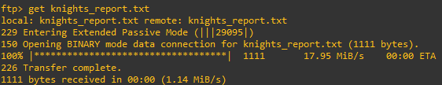

2. Dilakukan pengujian put, seharusnya tidak bisa karena yang punya akses write hanya Alice


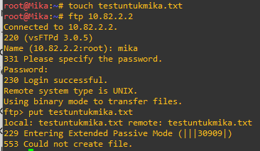

Namun pesan error yang muncul bukan error 550 permission denied, melainkan 553 could not create file
## Nomor 10

---

Command yang dieksekusi di node Knights adalah:
ping -c 77 -s 128 -i 0.3 10.82.2.2

Berikut adalah hasil statistik dari terminal Knights:

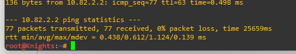

Berdasarkan hasil di terminal, dapat dianalisis bahwa:
- Packet Loss: Terjadi 0% packet loss (77 paket dikirim dan 77 paket diterima), yang berarti jaringan sangat stabil dan tidak ada paket yang hilang.
- RTT (Round Trip Time): Waktu tempuh minimum (min) adalah 0.438 ms, rata-rata (avg) adalah 0.612 ms, dan maksimum (max) adalah 1.124 ms.

Selain itu, dilakukan analaisis untuk paket request dan reply di wireshark:

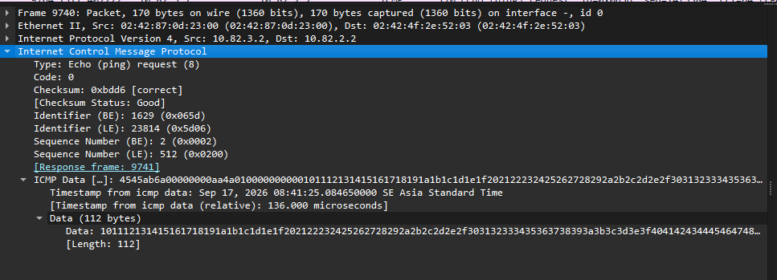
Dari gambar di atas, pada saat node Knights mengirimkan paket (Echo request) ke Chisa, nilai ICMP Type yang digunakan adalah 8 dan Code-nya adalah 0.

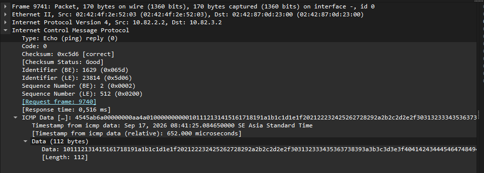
Sedangkan saat server Chisa membalas (Echo reply) ke node Knights, nilai ICMP Type yang digunakan adalah 0 dan Code-nya adalah 0.

## Nomor 11

---

Install telnet terlebih dahulu
```bash
apt-get install telnetd -y
useradd -m -s /bin/bash phantom_user passwd phantom_user
```
lalu masukkan wired_ghost saat diminta password.

Lalu coba login dari terminal eiri sembari mengcapture packet nya.

install telnet juga di eiri lalu lakukan koneksi telnet
```bash
telnet 10.82.2.2
```

masukkan username dan password yang tadi.

Lalu masuk ke wireshark dan filter untuk telnet, lakukan follow TCP stream pada salah satu paket sesuai instruksi di soal

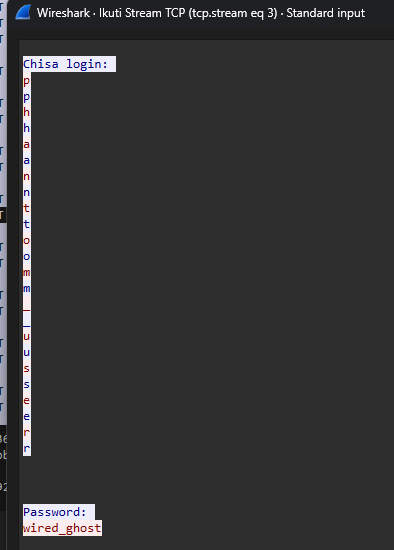

Dari hasil tangkapan tersebut, terdapat dua hal yang dapat disimpulkan:
1. Kredensial Plain Text: Telnet tidak menggunakan enkripsi sama sekali, bisa dilihat password dan usernamenya.
2. Karakter Dikirim Terpisah: Karena kan server mengirim teks username:, lalu menunggu input Anda. Karena username bukan informasi rahasia, karakter yang Anda ketik akan ditampilkan (echo) di layar. Kelihatan juga tiap huruf muncul double dan warnanya beda, karena warna merah muncul terlebih dahulu, berarti itu input dari kita, sedangkan yang warna biru merupakan echo dari server untuk ditampilin lagi di layar kita, sedangkan untuk password tidak di echo makanya munculnya tidak terpisah

## Nomor 12

---

Install netcat terlebih dahulu di node knights:
```bash
apt-get update 
apt-get install openssh-server -y service ssh start
```
lalu buka port 80:
```bash
nc -l -p 80 &
```

Selanjutnya start capture di kabel node Alice, lalu di terminalnya run command untuk memindai port-port yang sesuai dengan di soal (22,80,7777)

```bash
nc -zv 10.82.3.2 22 80 7777
```

Screenshot Wireshark yang membandingkan respons ketiga port tersebut:

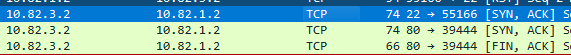

Analisis:
- Port Terbuka (Port 22 dan Port 80): Hal ini menandakan bahwa server menerima permintaan koneksi dan siap untuk melanjutkan proses three-way handshake pada port yang terbuka (dalam kasus ini port SSH dan Netcat)
- Port Tertutup (Port 7777): Server Knights langsung merespons dengan flag [RST, ACK]. Flag RST (Reset) ini berfungsi memutuskan koneksi karena tidak ditemukannya device di port itu (port tertutup).

## Nomor 13

---

1. Siapkan akun di Knights
```bash
useradd -m -s /bin/bash mika_admin passwd mika_admin
```
2. Buat ssh key di mika lalu kirim ke knights
```bash
ssh-keygen
```

```bash
ssh-copy-id mika_admin@10.82.3.2
```

3. Matikan fitur login password agar hanya bisa login pakai ssh key yang baru saja dikirim

```bash
echo "PasswordAuthentication no" >> /etc/ssh/sshd_config 
service ssh restart
```

Lalu untuk pembuktiannya di wireshark:

1. Start capture dulu
2. Di terminal Mika, login ssh menggunakan `ssh mika_admin@10.82.3.2` (seharusnya langsung masuk ke terminal knights tanpa ditanya password)
3. Cari paket sshv2 di wireshark 

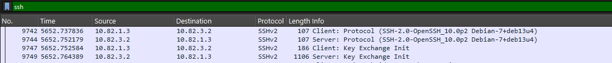

Dari analisis Wireshark, dapat terlihat jelas perbedaan mendasar antara SSH dan Telnet:
- Protocol Version Exchange: Pada awal koneksi, terlihat paket "Client: Protocol" dan "Server: Protocol" di mana kedua belah pihak verifikasi versi SSH yang digunakan (SSH-2.0-OpenSSH).
- Key Exchange Init: Setelah versi diverifikasi, client dan server segera melakukan Key Exchange Init untuk membangun encrypted tunnel.
- Kredensial Terenkripsi: Tidak seperti Telnet yang mengirimkan kredensial secara plain text, kredensial pada SSH (mika_admin) tidak dapat dibaca di Wireshark. Seluruh proses pertukaran data dibungkus di dalam encrypted tunnel.