# Laporan Sementara Modul 1

## Nomor 1

---


Router (lain) disini menggunakan debinet

config di router :
Konfigurasi IP tersebut dimasukkan pada *router* sebagai berikut (prefix kelompok adalah 10.82.x.x):

```bash
# Config eth1
auto eth1
iface eth1 inet static
    address 10.82.1.1
    netmask 255.255.255.0

# Config eth2
auto eth2
iface eth2 inet static
    address 10.82.2.1
    netmask 255.255.255.0

# Config eth3
auto eth3
iface eth3 inet static
    address 10.82.3.1
    netmask 255.255.255.0
```

Setiap *client* juga diatur IP statisnya melalui file `/etc/network/interfaces` di masing-masing *node*.
Bukti kalau router sudah berhasil meneruskan data antar switch (subnet). Di sini, *client* Alice melakukan ping ke IP *client* Chisa:
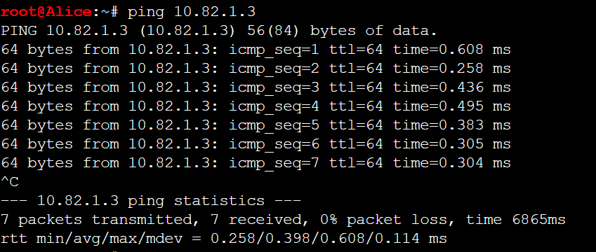

## Nomor 2

---

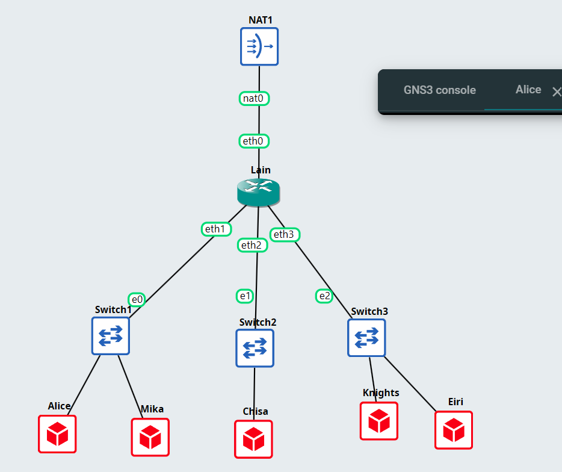

(NAT menggunakan eth0 di router sesuai instruksi pada soal)

Config di router untuk NAT:

```bash
# Config eth0 
auto eth0
iface eth0 inet dhcp
    up sysctl -w net.ipv4.ip_forward=1
    up iptables -t nat -A POSTROUTING -o eth0 -j MASQUERADE
```
Bukti berhasilnya terhubung:
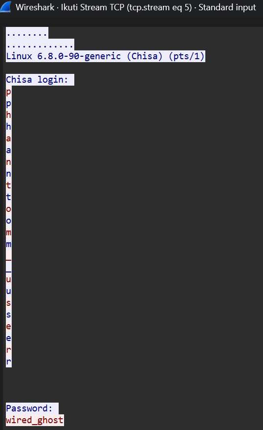


## Nomor 3

Diminta untuk memastikan seluruh *client* yang berada di bawah Switch 1, Switch 2, dan Switch 3 dapat saling terhubung dan berkomunikasi setelah router terhubung ke internet.

Dikarenakan di config router tadi sudah menambahkan:

```bash
up sysctl -w net.ipv4.ip_forward=1
```

Dimana perintah ini berguna untuk mem-forward routing dari satu *client* ke *client* lainnya.
Dan juga, di seluruh *client* sudah diatur IP statisnya beserta *gateway* yang mengarah ke router (10.82.x.1) melalui file konfigurasi `/etc/network/interfaces`.

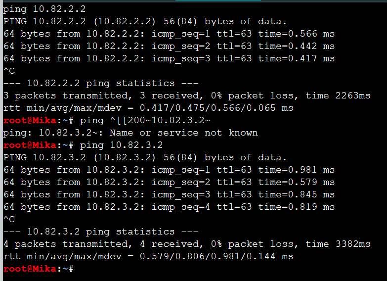
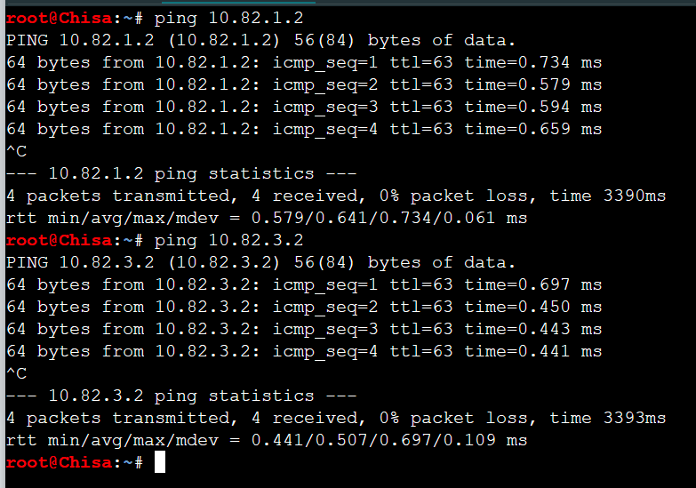
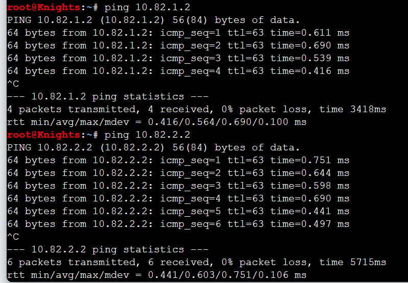

Keterangan konfigurasi IP *Client*:
- 10.82.1.2 = Client pada Switch 1 (Mika)
- 10.82.2.2 = Client pada Switch 2 (Chisa)
- 10.82.3.2 = Client pada Switch 3 (Knights)

Mika kan berada di switch 1 jadi dilakukan ping untuk ip switch 2 dan 3, begitu juga yang lainnya, dilakukan ping untuk mengecek koneksi di switch yang lain


## Nomor 4

---

Untuk NAT Masquerade sudah di-setup sebelumnya di router:

```bash
up iptables -t nat -A POSTROUTING -o eth0 -j MASQUERADE
```

Tinggal bagian DNS Resolver:
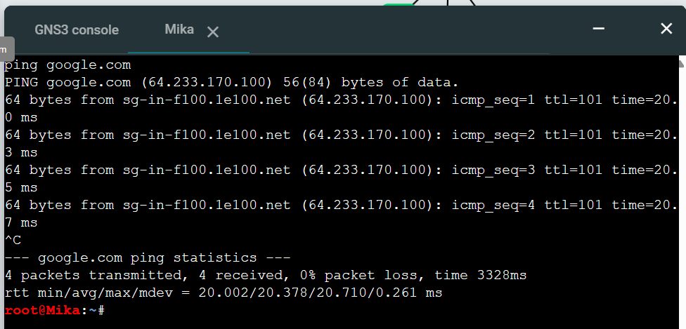

Awalnya dicoba untuk ping google.com dan ternyata masih belum bisa. Lalu dilakukan pemasangan DNS resolver dengan memodifikasi file `/etc/resolv.conf` pada setiap *client* berbasis Linux (Alpine/Debian) menggunakan *command*:
```bash
echo "nameserver 8.8.8.8" > /etc/resolv.conf
```

Setelah itu coba ping google.com kembali dan sudah berhasil.

Bukti untuk client lainnya:
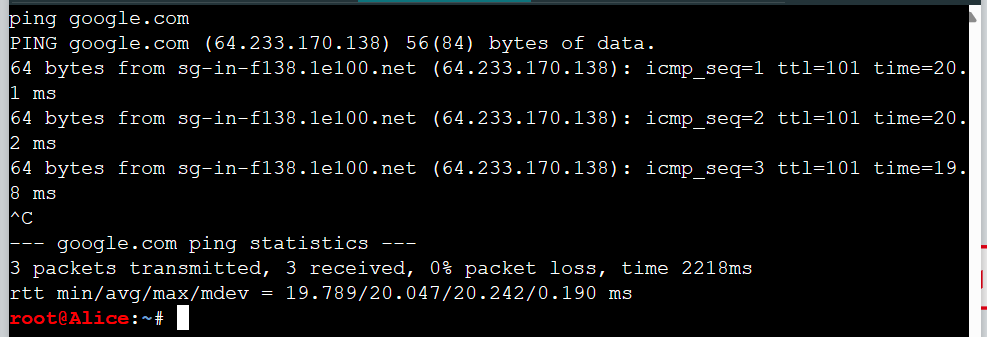
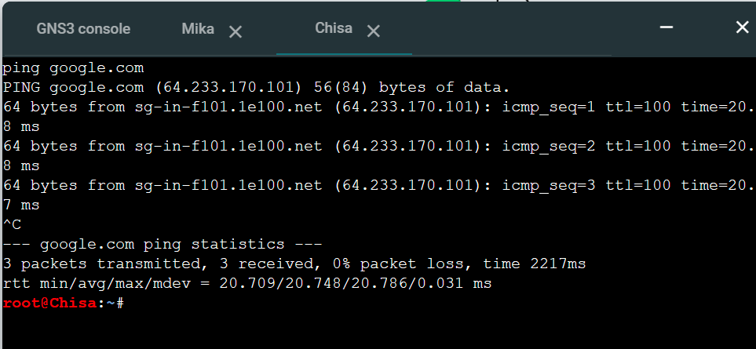
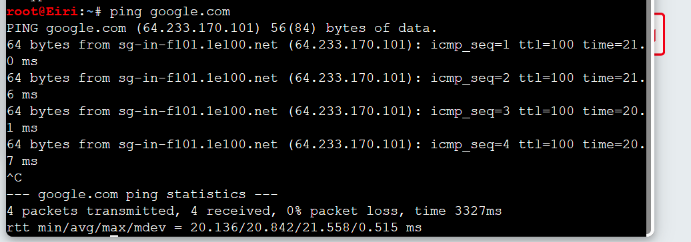
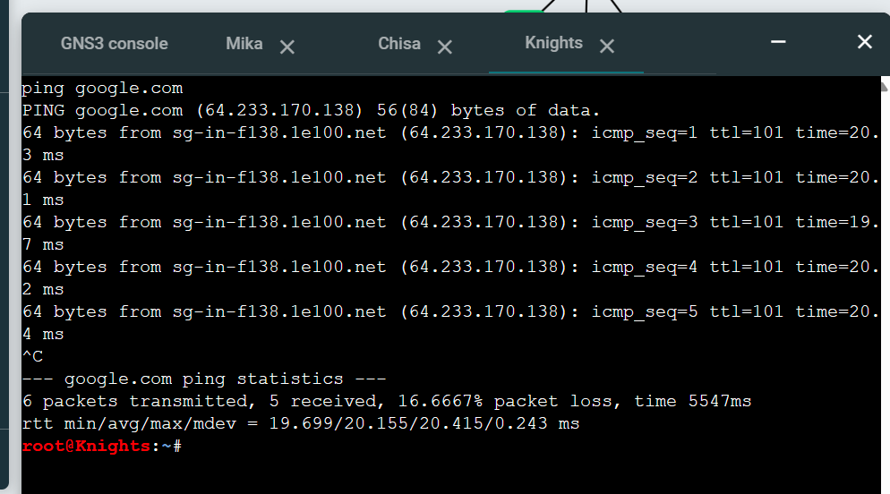
