# Jarkom-Modul-1-2026-K-37

| Nama  | NRP  |
|---|---|
| Gede Satya Putra Aryanta   |  5027251012 |
|  Azfaro Zid Ilmi | 5027251018  |


## 14. Web Brute Force

Menganalisis lalu lintas HTTP pada file capture untuk mengidentifikasi alamat IP penyerang, alamat IP target, port yang diserang, password yang berhasil digunakan, serta informasi web server.


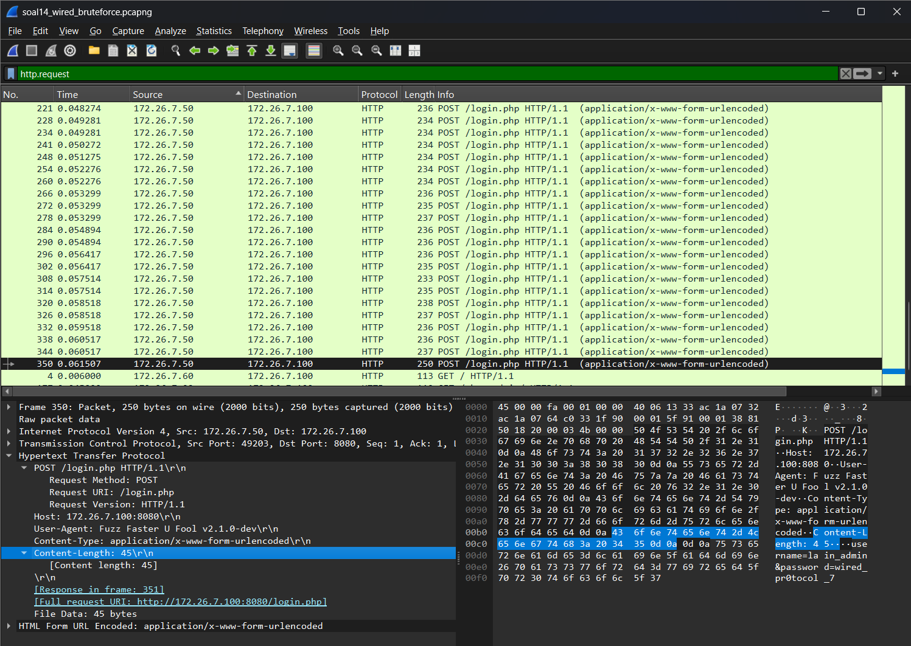


Hasil
```text
IP Penyerang: 172.26.7.50
IP Target: 172.26.7.100
Port Target: 8080
```
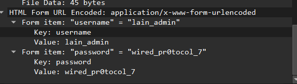

Pada bagian File Data terlihat:

```text
username = lain_admin
password = wired_pr0tocol_7
```
Request tersebut kemudian mendapatkan response pada Frame 351 dengan  menunjukkan bahwa request pada Frame 350 mendapatkan response berhasil.

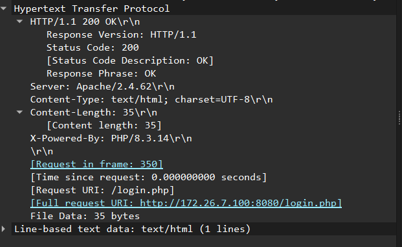

Hasil
```text
Username: lain_admin
Password: wired_pr0tocol_7
Request: Frame 350
Response: Frame 351
Status Code: 200 OK
Web Server: Apache
Versi: 2.4.62
```


### Validasi Socket Server

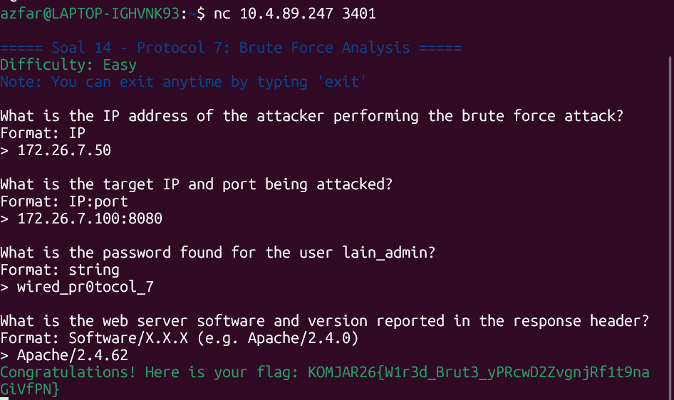

Memvalidasi hasil analisis brute-force HTTP, seperti IP target, port yang diserang, dan informasi login.

## 15. Analisis wired_usb_hid.pcap

Pada proses USB device enumeration, dilakukan analisis terhadap paket GET DESCRIPTOR Response DEVICE. Dari bagian Device Descriptor diperoleh:

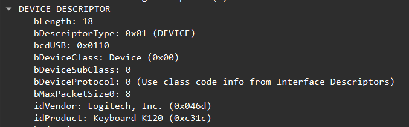


| Parameter  | Hasil    |
| ---------- | -------- |
| Vendor ID  | `0x046d` |
| Product ID | `0xc31c` |

Device tersebut teridentifikasi sebagai perangkat keyboard Logitech.
### device adress
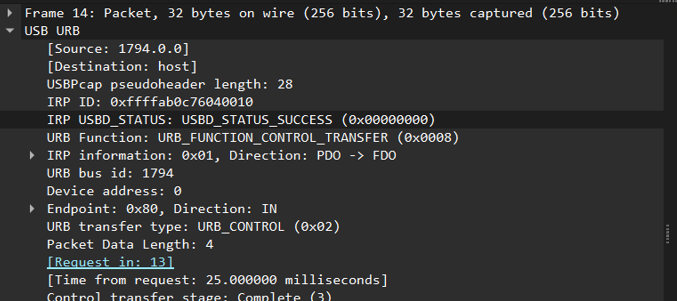

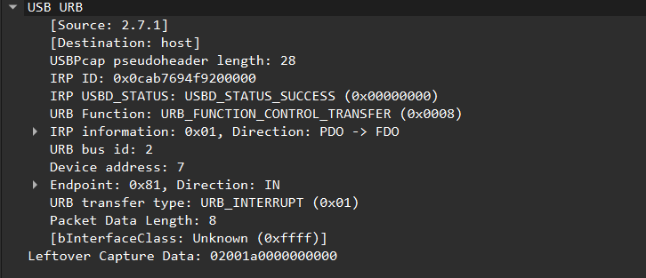

Pada paket USB HID yang membawa data input keyboard, ditemukan Device Address 7. Address 0 muncul pada tahap awal proses enumeration, sedangkan komunikasi HID selanjutnya menggunakan address 7.

### analisis input keyboard


Paket input keyboard dapat ditemukan pada paket URB_INTERRUPT in. Salah satu contoh data yang diperoleh:
```text
02 00 1a 00 00 00 00 00
```


Byte pertama (02) merupakan modifier Left Shift, sedangkan byte ketiga (1a) merupakan keycode. Berdasarkan pemetaan HID keyboard, keycode tersebut merepresentasikan huruf W, sehingga kombinasi tersebut menghasilkan W. Paket dengan keycode 00 merupakan report tanpa tombol yang ditekan/release report, sehingga tidak diterjemahkan sebagai karakter.

### Kata Rahasia

Dengan membaca keycode non-zero pada paket-paket URB_INTERRUPT in secara berurutan dan menerjemahkannya ke karakter keyboard, diperoleh:
```bash
wired_protocol_7_is_alive_2026
```
### socked server
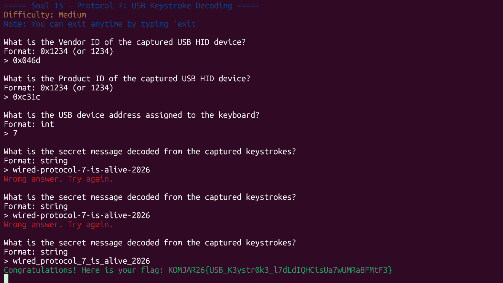

Memvalidasi hasil analisis USB HID, terutama alamat/device address keyboard dan pesan dari keystroke.

## 16. Analisis FTP Theft

Berdasarkan analisis file wired_ftp_theft.pcap, ditemukan bahwa server FTP penyerang menggunakan vsftpd versi 3.0.5. Proses autentikasi menggunakan username knights_agent dengan password N4v1_s3cur3_2026 dan mendapatkan respons 230 Login successful. File malware knights_payload.exe kemudian diakses menggunakan perintah RETR. Ukuran file diketahui sebesar 524288 bytes berdasarkan respons SIZE dengan kode 213.

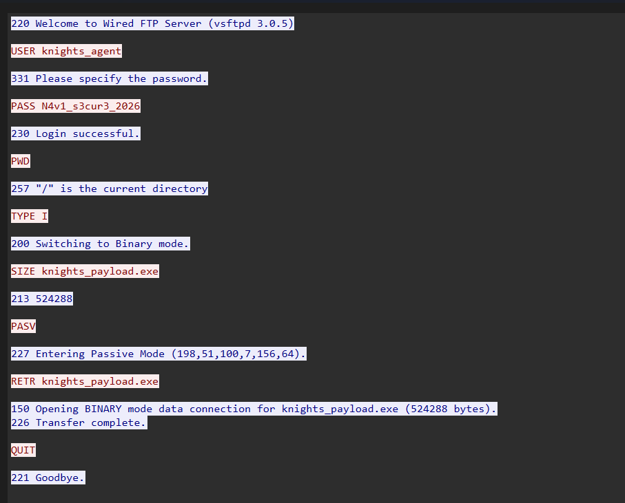


| Parameter                   | Hasil                 |
| --------------------------- | --------------------- |
| IP Server FTP Penyerang | 198.51.100.7        |
| FTP Software/Banner     | vsftpd 3.0.5        |
| Username                | knights_agent       |
| Password                | N4v1_s3cur3_2026    |
| Nama File Malware       | knights_payload.exe |
| Ukuran File             | 524288 bytes        |


### socked server
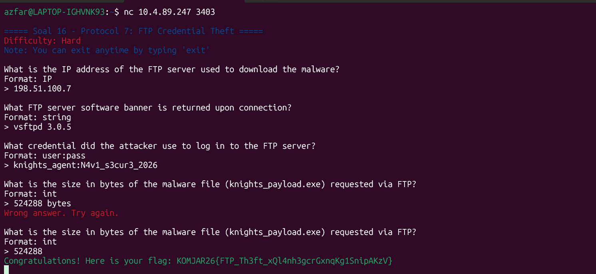

Memvalidasi hasil analisis FTP, seperti server FTP, kredensial, software/banner, dan ukuran file.

## 17 HTTP C2
 ditemukan adanya komunikasi HTTP antara sistem Alice dengan server yang digunakan untuk mengunduh payload. Pada Frame 30, terlihat HTTP request GET /navi_agent.exe HTTP/1.1 dengan header Host: wired-update.net. Request tersebut dikirim menuju server dengan IP 203.0.113.42. Pada Frame 31, server memberikan response HTTP/1.1 200 OK, yang menunjukkan bahwa request berhasil diproses dan file executable berhasil diakses.

 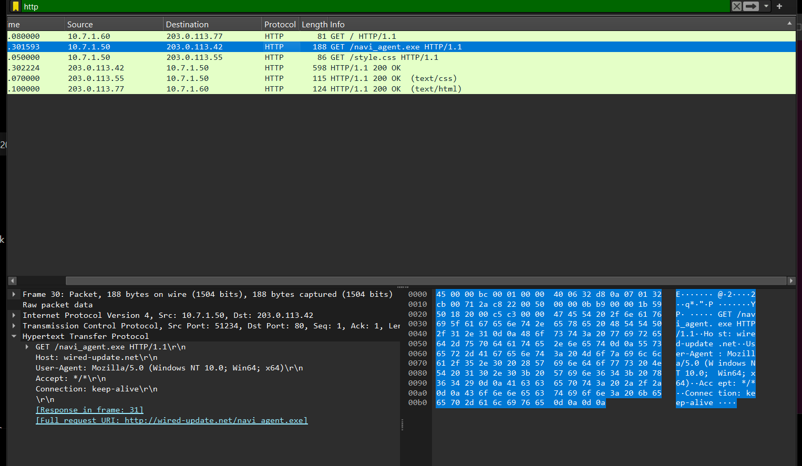


 | Parameter                | Hasil              |
| ------------------------ | ------------------ |
| Host/Domain          | wired-update.net |
| IP Server Penyerang  | 203.0.113.42     |
| Nama File Executable | navi_agent.exe   |
| HTTP Status Code     | 200 OK           |


## socked server

 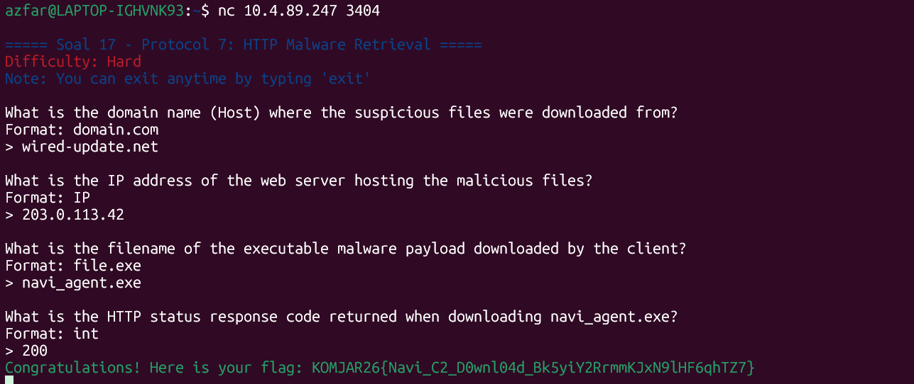

Memvalidasi hasil analisis HTTP C2, seperti domain/Host, IP server, nama executable, dan status HTTP.
## 18. SMB

tujuan menganalisis file capture wired_smb_transfer.pcapng untuk mengidentifikasi nama protokol jaringan yang dieksploitasi, IP pengirim dan penerima, folder tujuan penyimpanan malware pada sistem korban, serta nama file executable malware yang ditransfer.

 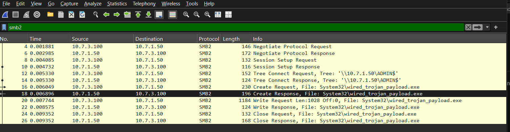

| Parameter     | Hasil                      |
| ------------- | -------------------------- |
| Protokol      | SMB2                     |
| IP Pengirim   | 10.7.3.100               |
| IP Penerima   | 10.7.1.50                |
| Folder Tujuan | System32                 |
| File Malware  | wired_trojan_payload.exe |

## socked server
 

Memvalidasi hasil analisis SMB transfer, seperti protokol, IP pengirim/penerima, folder tujuan, dan nama file.

 ## 19 SMTP
 Menganalisis dengan cara meneror jaringan dan mengirimkan email pemerasan melalui protokol SMTP tanpa enkripsi. Analisis file capture wired_smtp_threat.pcap pada stream TCP terkait, identifikasi alamat email korban yang ditargetkan, password korban yang diklaim bocor oleh penyerang, jenis malware yang diinfeksikan, batas waktu (dalam hari) yang diberikan, serta MailClientID yang tercantum pada pesan. 
```text
220 mail.protocol7.co.jp ESMTP Postfix

EHLO darkwired.net

250-mail.protocol7.co.jp Hello

MAIL FROM:<attacker@darkwired.net>

250 2.1.0 Ok

RCPT TO:<victim@protocol7.co.jp>

250 2.1.5 Ok

DATA

354 End data with <CR><LF>.<CR><LF>

From: attacker@darkwired.net
To: victim@protocol7.co.jp
Subject: URGENT: Your Wired account has been compromised
Date: Thu, 10 Sep 2026 09:00:00 +0700
MIME-Version: 1.0
Content-Type: text/plain; charset=UTF-8

I have compromised your system through Protocol 7.

I know that: pr0tocol_7_user - is your password!

Your computer was infected with my private ransomware.
I have access to all your files, emails, and The Wired accounts.
I recorded everything through your NAVI terminal.

If you do not pay me 2 BTC to the following address:
bc1qxy2kgdygjrsqtzq2n0yrf2493p83kkfjhx0wlh

I give you 72 hours (3 days) to get the bitcoins and pay.
After that, I will release everything to The Wired.

Do not try to contact the Knights. They cannot help you.
Let's all love Lain.

MailClientID: 7719980706
.


250 2.0.0 Ok: queued

QUIT

221 2.0.0 Bye
```

 hasil
 | Parameter       | Hasil      |
| --------------- | ---------- |
| Email korban    | victim@protocol7.co.jp |
| Password korban | pr0tocol_7_user        |
| Jenis malware   | ransomwar              |
| Batas waktu     | 3 hari                 |
| MailClientID    | 7719980706             |

## socked server
 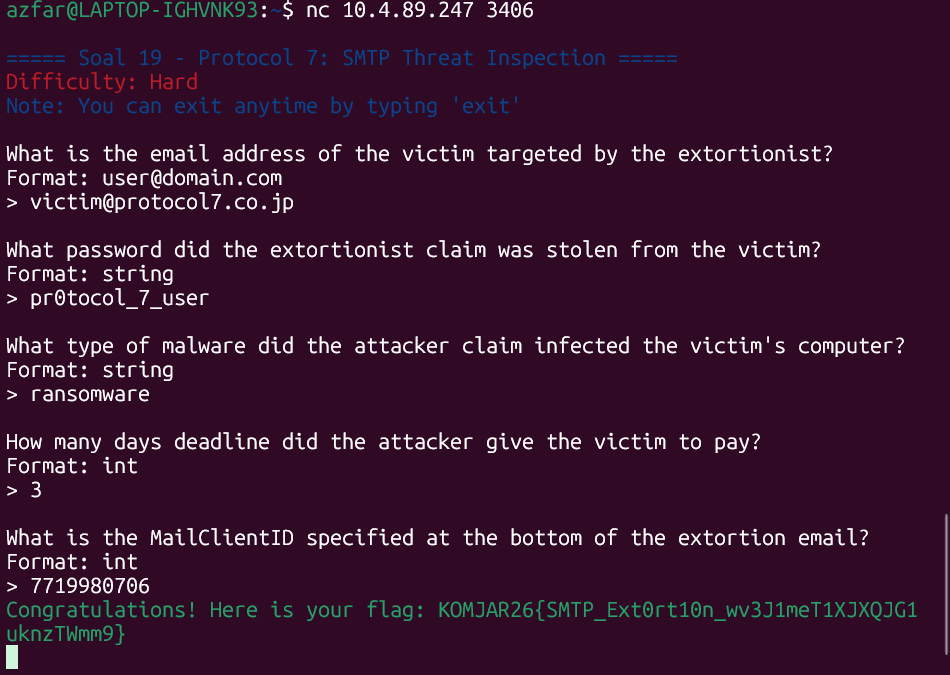

Memvalidasi hasil analisis SMTP threat, seperti email korban, password yang diklaim bocor, jenis malware, deadline, dan MailClientID.

## 20 TLS
menyembunyikan komunikasi malware di balik saluran terenkripsi TLS. Namun Alice telah menyediakan file keylog untuk mendekripsi lalu lintas data tersebut. Analisis file capture wired_tls_decrypt.pcapng bersama keyslogfile.txt untuk mengidentifikasi versi protokol TLS yang dinegosiasikan, nama domain (SNI) yang diakses, alamat IP server HTTPS penyerang, User-Agent yang digunakan, serta HTTP request method dan path yang tersembunyi di dalam sesi dekripsi. Validasi temuan kalian pada socket server

```text
HEAD / HTTP/1.1
Host: example.com
User-Agent: curl/7.62.0
Accept: */*
```
 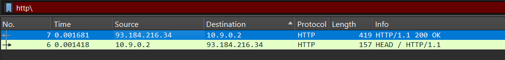


| Parameter       | Hasil |
| --------------- | ----- |
| TLS Version     | tlsv1.2       |
| SNI / Domain    | example.com   |
| IP Server HTTPS | 93.184.216.34 |
| User-Agent      | curl/7.62.0 |
| HTTP Method     | HEAD |
| HTTP Path       | /|

## socked server
 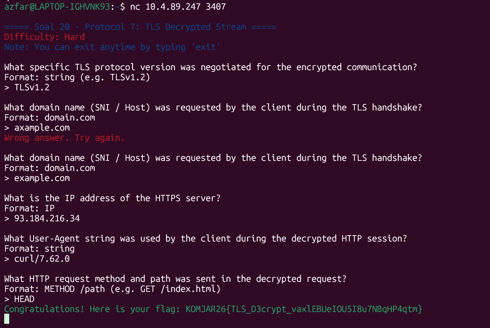
Memvalidasi hasil analisis TLS decryption, seperti TLS version, SNI/domain, IP server, User-Agent, method, dan path HTTP.